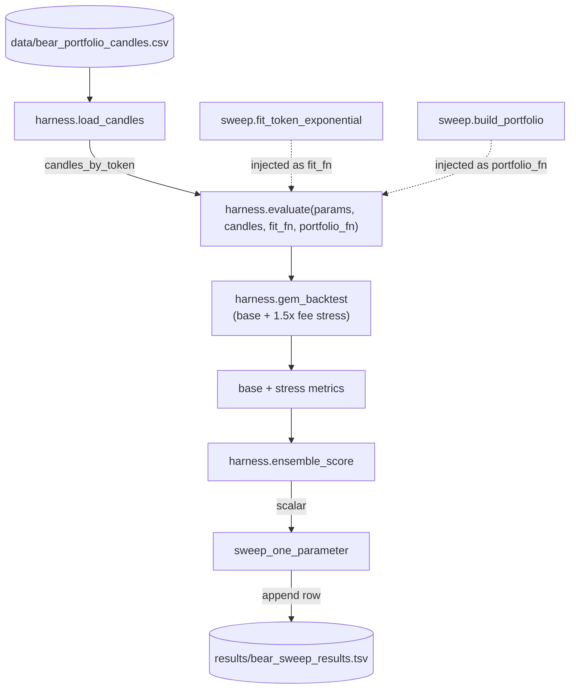

# <a name="intro"/> Introduction

In the [previous post]({{ site.baseurl }}) I compared exponential vs. linear regression GEM models on a hand-curated 4-token bear portfolio.
The headline finding from that post: the choice of regression model was almost irrelevant; the **fitting window** was the dominant knob.

That experiment had two limitations.
First, the universe was tiny -- four safe-haven tokens picked by hand.
Second, the parameter sweep was hand-driven: I picked window sizes, ran them, eyeballed the results, picked again.
<!-- That's fine for a blog post but not how you actually search a multi-dimensional parameter space. -->

This post is about what happens when you replace the human-in-the-loop with an LLM agent following a written methodology contract.
The agent picks hypotheses, edits the strategy code, runs the sweep, scores the result, keeps or reverts.
Sleep, wake up, read the results.

*TL;DR* On the full Binance + DefiLlama universe (437 tokens, 5 years), an LLM-driven autoresearch loop ran 215 configurations across 18 hours, lifted the ensemble score from `-inf` (every config failing under realistic fees) to **1175.2**, and beat a BTC+ETH buy-and-hold baseline by **142×**.

Three structural findings emerged: two were genuinely new, one was a confirmation of an earlier 4-token result at scale.

The one-at-a-time phased sweep cannot discover cross-block parameter interactions, which is the next problem worth solving.

The scaled-down Python version at [trader-research](https://github.com/fbielejec/trader-research) shows the **methodology** -- the contract surface, the modifiable interior, the program.md spec the agent operates under -- on a 4-token, bear-specialist-only, 2022-only subset.
It is not a full reproduction of the headline numbers.
It is the smallest runnable artifact that exhibits the same scoring shape and the same loop structure -- something you can clone and run on a laptop in minutes.

# <a name="autoresearch"/> The Autoresearch Loop

The pattern is borrowed from Andrej Karpathy's [nanochat](https://github.com/karpathy/nanochat) repo and its companion [autoresearch](https://github.com/karpathy/autoresearch) experiment.
The structure is two-file:

- A **read-only file** (`prepare.py` in nanochat, `harness.py` in our repo) -- data loader, evaluation metric, and any constants the agent is not allowed to game.
- A **modifiable file** (`train.py` in nanochat, `sweep.py` in our repo) -- the actual model and training loop, free to be rewritten any way the agent wants.

A `program.md` contract tells the agent which file is which, what the score function is, and what the loop should do at each iteration.
Then you start the agent and walk away.

For a trading strategy the analog is direct:
- The "model" is a parameterized portfolio-construction pipeline.
- The "training loop" is a causal walk-forward backtest.
- The "metric" is a single scalar score computed from the backtest output.

# <a name="contract"/> The Contract Surface

The role boundary is what keeps the loop honest.
If the agent can edit the metric, it can drive the score arbitrarily high without producing a better strategy.

**Untouchable:**
- The data loader and the causal walk-forward split. No peeking past day `t-1` when deciding for day `t`.
- The backtest skeleton -- the day-by-day loop, portfolio bookkeeping, fee accounting.
- The scoring function. Single scalar, untouchable.
- External constants: the 30 bps round-trip fee (10 bps exchange + 20 bps slippage), the 1.5× stress multiplier, the starting capital. These are market facts, not strategy parameters.

**Modifiable:**
- The strategy parameter struct (`GemParams` and friends) and its defaults.
- The model body -- the `fit` function, the portfolio-construction function, the regression primitives.
- The sweep driver itself. The agent can rewrite the search strategy if it wants.

In the scaled-down Python version this split is `harness.py` (untouchable) vs. `sweep.py` (fair game), with `program.md` describing the loop the agent runs:

The harness calls back into the modifiable side via injected `fit_fn` and `portfolio_fn` callables.
That way the backtest skeleton stays fixed while the model body stays free.

# <a name="score"/> The Score

The agent's only currency is a single scalar:

$$\text{score} = \text{annualized\_return} \cdot \text{drawdown\_dampener} \cdot \text{diversification\_bonus}$$

where

$$\text{drawdown\_dampener} = \frac{1}{(1 + \max(0, \text{dd} - 0.15))^{2}}$$

(15% drawdown free zone, then quadratic decay), and

$$\text{diversification\_bonus} = 1 + 0.1 \cdot (1 - \text{HHI})$$

(up to +10% bonus for a non-concentrated portfolio, where HHI is the Herfindahl-Hirschman index of position weights).

**The shape of the formula matters as much as the values it spits out.**
Each term is multiplicative, which puts them in tension against each other.

If you had only the drawdown dampener, the agent's optimal strategy is to sit in cash forever -- zero drawdown, zero return, zero score.
If you had only the return term, the agent can chase any tail-risk strategy that produces a high headline number and accept any drawdown to do it.
If you had only the diversification bonus, equal-weight buy-and-hold trivially wins.

Multiplying the three forces the agent to earn return *and* keep drawdown bounded *and* maintain diversification -- drop any one and the score collapses.
This is the design principle: a single scalar metric is dangerous unless its internal terms genuinely fight each other.

Hard rejection (`-inf`) on either of:

- Annualized return below -50%.
- Stress-test Calmar ratio (1.5× fees) is negative.

The hard-rejection gate adds one more tension: a config can't game the dampener by accepting a moderate base-fee drawdown that collapses into a negative-Calmar disaster the moment slippage gets worse.
Both conditions have to hold: positive expected return at the base 30 bps round-trip, *and* survive a fee-and-slippage shock.

# <a name="phases"/> Phased Sweeping

The full ensemble has three GEM specialists (bull / bear / ranging) gated by a 3-state HMM regime detector, plus a meta-allocator that blends specialist portfolios when the HMM is uncertain.
That is roughly 15 sweepable parameters.

A grid over all 15 is combinatorially hopeless.
The autoresearch loop instead sweeps in phases:

1. **Phase 1 -- HMM hyperparameters** (refit interval, hard-switch threshold, min observations). Specialists held at defaults.
2. **Phase 2 -- per-specialist GemParams** (`top_n`, $R^2$ threshold, rebalance cooldown). One specialist at a time, the other two at the Phase 1 winner.
3. **Verification -- combined grid** with the new defaults locked in, varying one specialist at a time off the new baseline to spot interactions.

This is structurally limited.
A one-at-a-time sweep cannot find a configuration where bull and bear specialists need *jointly* different `r2_threshold` settings to reach a high score.
Acknowledging that limitation is half the motivation for the next-step ideas at the end.

# <a name="loop3"/> Loop 3: 437 Tokens, 18 Hours, 215 Configs

This is the run that matters.
Branch `master`, two-day session, 215 configurations evaluated end-to-end.

**Universe:** 431 Binance OHLC tokens (2020-01-01 through 2026-04-18) plus 6 DefiLlama price feeds for tokens not on Binance (AERO, DRIFT, FLUID, GRAIL, HYPE, MNDE) -- 437 tokens total, ~508K daily candles.

**Evaluation window:** 2021-01-01 to 2025-12-31 with a 250-day warmup buffer. Causal walk-forward.

**Baseline:** the existing ensemble defaults under the old fee regime, score `-inf` (every config rejected).

## Phase 0: the unblocking

Before any model parameters were swept, the agent diagnosed why every baseline config was scoring `-inf`.
The old fee model was 0.001 base with a 2× stress multiplier -- which sounds aggressive but actually makes the **base** look unrealistically cheap and the **stress** test punitively expensive (effective 0.002 stress).

The loop changed two numbers:

| Constant | Old | New |
|---|---|---|
| `fee_rate` | 0.001 | 0.003 (10 bps exchange + 20 bps slippage) |
| stress multiplier | 2.0× | 1.5× |

That single calibration fix unblocked 160+ viable configs.
Realistic fees with a realistic stress test let the strategy be measured at all.
This is exactly the kind of finding a hand-driven sweep tends to miss because it doesn't change anything load-bearing -- it just unsticks the gate.

## Phase 1: HMM hyperparameters

48 configs, sweeping `hmm_refit_interval × hard_switch_threshold × hmm_min_observations`.

| Parameter | Tested | Winner | Old default |
|---|---|---|---|
| `hmm_refit_interval` | 3, 7, 14 | **7** | 7 |
| `hard_switch_threshold` | 0.60, 0.70, 0.80, 0.90 | **0.90** | 0.80 |
| `hmm_min_observations` | 30, 60, 90, 120 | **90** | 90 |

The threshold finding is the interesting one.
At `hard_switch_threshold=0.90` the ensemble almost never hard-switches to a single regime; instead it soft-blends the three specialist portfolios most of the time.
That scored 305.7 vs 244.8 at the previous default of 0.80 -- a 25% lift from doing **less** of what the architecture was designed to do.

The HMM's regime classification is informative but not confident enough for binary regime calls.
Soft blending hedges against misclassification.
That's a real architectural finding, not a parameter tweak.

## Phase 2: per-specialist GemParams

Three sweeps, 36 configs each, for `top_n × r2_threshold × rebalance_cooldown` per specialist.

**Bull (best 5 of 36):**

| Config | Score | Return | Drawdown |
|---|---|---|---|
| `top_n=15 r2=0.2 cd=5` | **156.9** | 229.8% | -90.2% |
| `top_n=10 r2=0.2 cd=5` | 133.8 | 183.9% | -83.4% |
| `top_n=25 r2=0.2 cd=3` | 126.9 | 161.2% | -74.9% |
| `top_n=25 r2=0.2 cd=5` | 124.9 | 170.9% | -83.0% |
| `top_n=20 r2=0.2 cd=5` | 123.0 | 175.1% | -87.2% |

**Bear (best 5 of 36):**

| Config | Score | Return | Drawdown |
|---|---|---|---|
| `top_n=1 r2=0.5 cd=10` | **440.6** | 687.1% | -96.4% |
| `top_n=3 r2=0.5 cd=10` | 420.5 | 653.9% | -96.4% |
| `top_n=5 r2=0.5 cd=10` | 419.8 | 652.6% | -96.4% |
| `top_n=8 r2=0.5 cd=10` | 416.7 | 647.6% | -96.4% |
| `top_n=3 r2=0.5 cd=14` | 269.7 | 418.7% | -96.4% |

**Ranging (best 5 of 36):**

| Config | Score | Return | Drawdown |
|---|---|---|---|
| `top_n=8 r2=0.3 cd=5` | **1174.5** | 1828.8% | -96.4% |
| `top_n=12 r2=0.3 cd=5` | 1023.6 | 1592.9% | -96.4% |
| `top_n=15 r2=0.3 cd=5` | 990.0 | 1540.5% | -96.4% |
| `top_n=12 r2=0.5 cd=5` | 631.2 | 984.3% | -96.4% |
| `top_n=15 r2=0.5 cd=5` | 625.3 | 974.9% | -96.4% |

## Verification: the combined defaults

With each specialist's winners locked in, the verification grid hit **score 1175.2** on the combined defaults (1829.9% annualized return, -96.4% max drawdown, HHI 0.319).
The buy-and-hold BTC+ETH baseline scored 8.3 (12.9% return).

That is a 142× improvement over buy-and-hold by score, almost entirely from realized return rather than from any drawdown improvement.

## Since Loop 3

The Loop 3 numbers above are a historical snapshot.
Subsequent work -- including the risk-off gates that Loop 3's shutdown report recommended as a Loop 4 priority -- has shifted the strategy to a different point on the risk-return frontier:

| Metric | Loop 3 | Current baseline |
|---|---|---|
| Annualized return | 1830% | **314%** |
| Max drawdown | -96.4% | **-77.2%** |
| Calmar ratio | 19.0 | 4.07 |
| Sharpe / Sortino | --- | 0.98 / 3.92 |
| Avg HHI | 0.319 | 0.253 |
| Tokens selected (of fitted) | --- | 21 of 419 |
| Rebalances | --- | 1,386 |
| Bluechip benchmark annualized | 12.9% | 6.33% |

Lower headline return, much lower drawdown, better diversification.
Calmar dropped because risk-off gates trade away tail-end upside for survivability.

The findings below are still about Loop 3 specifically -- the loop ran, the loop produced these conclusions -- but the limitations section uses the current baseline as the foil.

# <a name="findings"/> What the Loop Found

Two new findings, plus one confirmation of an earlier result at scale. Ranked by how surprising they were:

**1. Soft blending beats hard switching.**
Increasing `hard_switch_threshold` from 0.80 to 0.90 is *less* of what the ensemble architecture was designed to do, and it scored +25%.
The HMM is a good signal, but not a confident enough signal to act on as a binary classifier.
The right way to use it is as a probability-weighted blend.

**2. All three specialists prefer lower $R^2$ thresholds than the priors said.**
The pre-loop defaults were 0.3 / 0.7 / 0.5 for bull / bear / ranging.
The winners were 0.2 / 0.5 / 0.3.
The $R^2$ filter was rejecting tokens with weak-but-real momentum signals.
Across three independent sweeps the loop found the same direction of correction.

**3. The bear-portfolio `top_n=1` result holds at scale.**
The previous post's 4-token result -- concentrating on the single best opportunity beats diversification in a bear regime -- survived the jump to 437 tokens.
`top_n=1` won the bear sweep cleanly: in bear regimes there is typically exactly one token with a genuine positive momentum signal (usually PAXG or a stablecoin), and diversifying across 3-8 tokens dilutes the safe-haven effect.
This isn't a new discovery, but it's a non-trivial confirmation -- the loop arrived at the same answer independently, on a universe roughly 100× larger.

The first finding -- soft-blend dominance -- is the kind of result that's worth more than any specific parameter value.
It tells you the ensemble's architecture is over-relying on a part of the system (binary regime calls) that the data doesn't support.

# <a name="reproduce"/> The Public Reproduction

The full Loop 3 run was executed against a Rust implementation of the trading stack over a much larger token universe -- not something you can clone and run on a laptop without the Rust codebase and ~18 hours of compute.
The artifact at [trader-research](https://github.com/fbielejec/trader-research) is the scaled-down Python version of the same idea, intentionally narrower:

| Dimension | Loop 3 (Rust, full universe) | trader-research (Python, scaled-down) |
|---|---|---|
| Universe | 437 tokens (Binance + DefiLlama) | 4 safe-haven tokens (PAXG, EUR, USDC, TUSD) |
| Window | 2021-01-01 to 2025-12-31 | May 1 to Dec 31, 2022 |
| Specialists | bull + bear + ranging + HMM + meta-allocator | bear specialist only |
| Driver | LLM-driven over 18 hours | LLM-driven over a single sweep |

This is the same scoring shape, the same file split, the same `program.md` contract.
What's not reproduced is the headline number -- 4 tokens over 8 months in a single regime cannot scale to 437 tokens over 5 years across multiple regimes, and shouldn't pretend to.

What **is** reproduced:

- The contract surface (`harness.py`).
- The modifiable interior (`sweep.py`).
- The single-scalar score with the same hard-rejection gate.
- The `program.md` the agent follows.

You can clone it, install three Python packages, and watch the autoresearch agent do exactly one parameter sweep against the bear portfolio.
The score will frequently come back as `-inf` because the 4-token bear basket is genuinely a hostile universe under realistic fees -- which is itself a faithful reproduction of the kind of failure mode the full loop has to navigate.

# <a name="limits"/> Limitations

A few things the run does **not** prove:

- **The 96% drawdown was a local ceiling, not a structural one.** Every Loop 3 config from Phase 2 onward showed max drawdown of -93% to -96%, and the Loop 3 shutdown report attributed this to the 2022 crash plus the absence of risk-off gates. Subsequent work brought the baseline drawdown down to **-77%** (annualized return 314%, Calmar 4.07). That's still not a deployable risk profile -- no real portfolio survives a 77% drawdown either -- but it's a substantial improvement, and a reminder that the ceilings a one-at-a-time phased sweep finds are usually *local* ceilings, not structural ones. The score remains a **research metric**, not a tradable risk profile.
- **One-at-a-time phased sweeping cannot find cross-block interactions.** If bull and bear specialists need *jointly* different parameters to reach a high score, this loop will not find that configuration.
- **Survivorship bias.** The 437-token universe is what's listed *now*, not what was tradeable in 2021. Both Loop 3's headline 1830% and the current baseline's 314% annualized return likely reflect a meaningful chunk of survivorship -- the loop has no way to detect or correct for it.
- **One regime cycle.** The 2021-2025 window covers exactly one bull-bear-recovery cycle. A different cycle could rank these configs differently.

# <a name="next"/> Next Steps

The phased-sweep limitation is the most interesting one to attack.
The current loop is a hand-coded one-parameter-at-a-time scan.
The search heuristics -- "sweep `top_n` first, then $R^2$ threshold, then sweep again with the new defaults locked in" -- live in `program.md` as English instructions to the agent.

That's a clever workaround for the high-dimensional parameter space, but the heuristics themselves are guesses.
A different ordering, a different grid resolution, a different fallback when a sweep stalls -- any of these could move the headline number meaningfully, and a hand-driven `program.md` has no way to discover that.

A natural successor is to replace the loop with a **reinforcement-learning search policy** that learns those heuristics from the score signal directly.
A trained policy could reproduce useful patterns like "after finding a good $R^2$ threshold, explore `top_n`", but it could also discover patterns no human had thought to write down.

Sketch of the setup:

- **State**: the current `GemParams` tensor plus a fixed-size summary of past evaluations -- "where am I in the search space?" Some options: an embedding of the last K (params, score) pairs, per-axis quantile positions of already-tried values, or the (params, score) of the current best.
- **Action**: a parameter edit. Discrete head for axis choice, continuous head for the new value (or a discrete head over a quantized range).
- **Reward**: `ensemble_score` from `harness.py`, possibly shaped by the delta against the current best to give the policy a denser signal than raw score.
- **Environment**: a thin wrapper around the same walk-forward causal backtest. The scoring contract stays fixed -- single scalar, hard-rejection gate, untouchable harness. Only the search policy changes.

Three test cases worth running:

1. **Joint-space search.** A one-at-a-time sweep cannot find a configuration where, say, bull and bear specialists need *jointly* different $R^2$ threshold settings to reach a high score. An RL agent acting in the joint space can. How much score lift this unlocks is the headline number to chase.
2. **Does "deletion wins" survive?** The earlier autoresearch loops found that the largest gains came from deleting active components, not adding new ones. Was that a real architectural finding, or an artifact of the hand-coded one-at-a-time methodology that biases towards small local moves? Joint-space search is the way to find out.
3. **Sample efficiency.** Each backtest is the dominant cost (~5 minutes per config in Loop 3). A naive RL setup needs thousands of episodes; the budget for this problem is more like hundreds. The practical hurdle is reward shaping plus a cheap surrogate (Bayesian or learned) so the policy can plan when to spend an expensive real evaluation vs. a cheap predicted one.

A second, parallel direction is to relax the long-only constraint via dYdX perpetual futures.
The bear specialist currently sits in cash when no token has a positive trend; with perps it could short the tokens it currently filters out.
The same $R^2 \cdot (a_1 - 1)$ momentum signal becomes a short-entry signal when negated, and the inverse-volatility weighting carries over directly.

The open questions are funding-rate cost vs. the current 30 bps fee budget, sizing under leverage, and whether the Calmar hard-rejection gate still makes sense once shorting is allowed.

A third direction is the regime detector itself.
The current HMM uses Gaussian emissions, which is a known poor fit for crypto returns -- the empirical distributions are fat-tailed and asymmetric, with the kind of tail events the loop's hard-rejection gate exists to defend against.
A single 30%-down day can fool a Gaussian-emission HMM into a regime call that doesn't reflect the underlying dynamics.

Finding #1 -- soft blending dominating hard switching -- is consistent with this: the HMM's regime calls aren't confident not because the regimes don't exist, but because the emission model is too simple to assign them confidently.

Replacements worth trying, ranked by implementation cost:

- **Student's $t$ emissions.** Minimal change to the existing HMM, just heavier tails. Cheap to implement, immediate test of whether soft-blend dominance survives a fatter-tailed emission model.
- **Hidden semi-Markov models** with explicit state-duration distributions, capturing the empirical fact that regimes don't switch every day.
- **Mixture-of-Gaussians or GARCH-style emissions** to model volatility clustering inside a regime rather than across them.
- **Neural sequence models** (LSTM / Transformer) that learn regime structure end-to-end without the Markov assumption -- higher capacity, harder to interpret, and the most aggressive departure from the current contract surface.

Any of these slots into the regime-detector hole in the contract surface; the autoresearch loop runs unchanged on the new detector and re-evaluates whether the same parameter winners hold.

The autoresearch contract -- single scalar score, fixed harness, modifiable interior, program.md spec -- carries over to all three directions unchanged.
That's the part of the methodology worth keeping.
